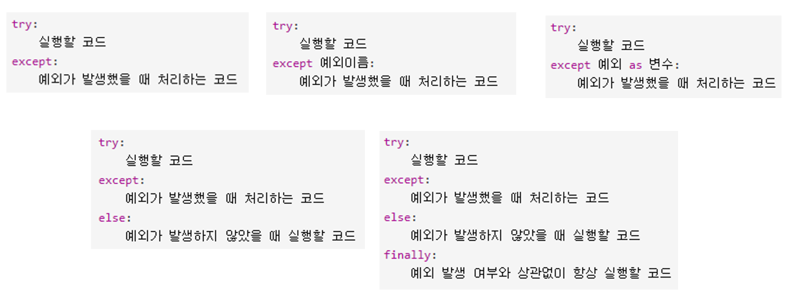

# 예외처리
전원이 다운되거나 심각한 문제는 불가항력적. 단, 실행시 발생되는 소소한 에러는 처리 후 실행 유지를 위한 작업이다. 
<br>

## try except syntax
1. 발생되는 모든 예외 처리
    ```python
    try:
        print(10 / 0)
    except:
        print('연산 오류 : ZeroDivision')
    ```
2. 특정 예외만 처리하기
    ```python
    try:
        <!-- 실행할 문장 -->
    except ZeroDivisionError:
        <!-- ZeroDivisionError일 경우 실행할 문장 -->
    except <!-- 특정 에러 -->:
        <!-- 특정 에러에서 실행할 문장 -->
    ```
3. 에러 메세지 받아오기
    ```python
    try:
        <!-- 실행할 문장 -->
    except <!-- 특정 에러 --> as e:
        <!-- 특정 에러를 e라는 변수명으로 사용한다. -->
    ```

4. 에러가 발생하지 않을 경우 실행하는 코드 : <font color=blue>else</font>
    ```python
    try:
        <!-- 실행할 문장 -->
    except:
        <!-- 에러시 실행할 문장 -->
    else:
        <!-- 에러가 발생하지 않을시 실행되는 코드 -->
    ```
5. 에러와 무관하게 항상 실행되는 코드 : <font color=blue>finally</font>
    ```python
    try:
         <!-- 실행할 문장 -->
    except:
        <!-- 에러시 실행할 문장 -->
    finally:
        <!-- 항상 실행되는 코드 -->
    ```
    <br>
- 참고 이미지



## Assertion
조건문이 False인 경우 AssertError를 발생시킨다.

- syntax
```python
# 메세지를 적을 경우
assert x >= 10, 'x는 10보다 작습니다.'
# AssertionError: x는 10보다 작습니다.

# 메세지를 적지 않을 경우
assert x > 0 
# AssertionError:
```
> if만 조건을 판별하는 것이 아니고 assert도 조건을 판별한다는 것을 알아두자.<br>

