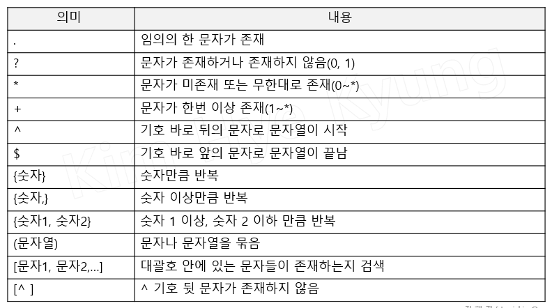
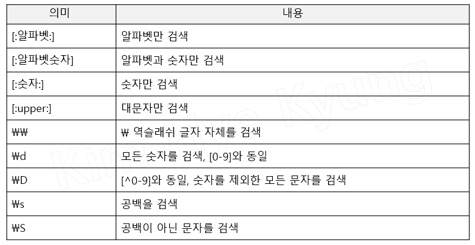
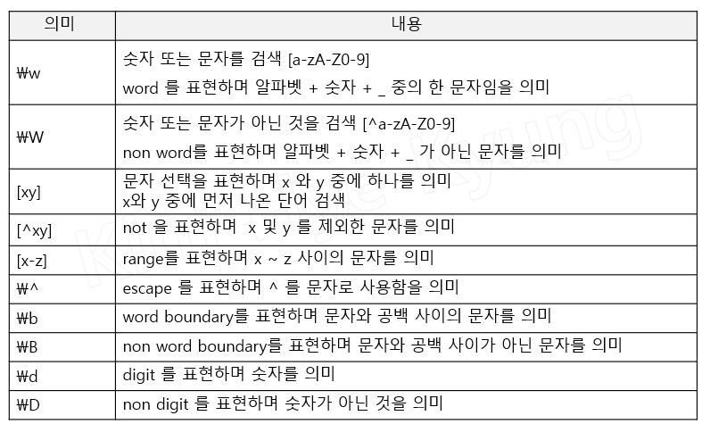

# 정규표현식 
- 일정한 규칙(패턴)을 가진 문자열을 표현하는 방법
- 복잡한 문자열 속에서 특정한 규칙으로 된 문자열을 검색한 뒤 출하거나 변경할 때 사용
- 문자열이 정해진 규칙에 부합한지 확인시에도 사용
<br>
<br>
<br>

## 표현식




> a* : a가 없거나 무한 루프를 돈다. <br>
> ab* : b가 ㅁ없거나 무한루프<br>
> \d{3}-\d{3,4}-\d{4} : 숫자 3개 - 숫자 3/4개 - 숫자 4개   라는 정규표현식
>
> ^ : 문자열의 시작<br>
> ^[0-9] : 문자열 시작에 숫자가 들어간다.<br>
> [^0-9] : 문자열에 숫자가 존재하지 않는다.


## 주요 functions
|함수명|기능|특징|
|-----|-----|-------|
|compile( )|형식(패턴)이 반영되는 함수|실행 속도가 좋음|
|search( )|데이터 전체에서 정규식에 부합하는 문자열 존재 여부 검색|
|match('패턴', '문자열')|데이터의 `처음부터` 정규식과 부합하는지 검색| 정규표현식 매치 객체가 반환|
|group( )|정규식에서 필터링한 데이터를 파이썬에서 출력시 사용|
|findall('패턴', '문자열')|정규식에 부합하는 모든 문자열을 리스트로 리턴|
|sub('패턴', '변경문자열', '문자열', 변경횟수)|패턴과 일치되는 부분을 다른 문자로 변경|
|split( )|주어진 문자열을 특정 패턴을 기준으로 분리|

```python
# 함수 사용 예시
# python에서 정규표현식을 사용하기 위해서 사용되는 library
import re

print(re.match('ab', 'ab'))     # <re.Match object; span=(0, 2), match='ab'>
print(re.match('ab', 'a'))      # None
print(re.match('ab', 'ba ab'))     # None
print(re.match('ab', 'tab'))        # None

print(re.match('a+b', 'ab'))        # <re.Match object; span=(0, 2), match='ab'>
print(re.match('a+b', 'acb'))       # None

print(re.search('\*+', 'a*a'))      # <re.Match object; span=(1, 2), match='*'>
print(re.search('\*+', 'a'))        # None

data = re.search('9\d{2}', 'test 9000 data')
print(data)     # <re.Match object; span=(5, 8), match='900'>

datas = 'encore 9824 playdata 1234 hello 25946546546 245 28984'
data = re.findall('2\d{3}', datas)
print(data)     # ['2594', '2898']

datas = 'encore 9824 playdata 1234 hello 25946546546 245 28984'
data = re.split('2\d{3}', datas)
print(data)     # ['encore 9824 playdata 1234 hello ', '6546546 245 ', '4']

datas = 'encore 9824 playdata 1234 hello 25946546546 245 28984'
data = re.sub('2\d{3}', '9000', datas)
print(data)     # encore 9824 playdata 1234 hello 90006546546 245 90004

```


### 참고 사이트
- [python 사이트](https://docs.python.org/ko/3.6/library/re.html#module-re)
- [정규표현식 시각화 및 검증 사이트](https://regexper.com/)